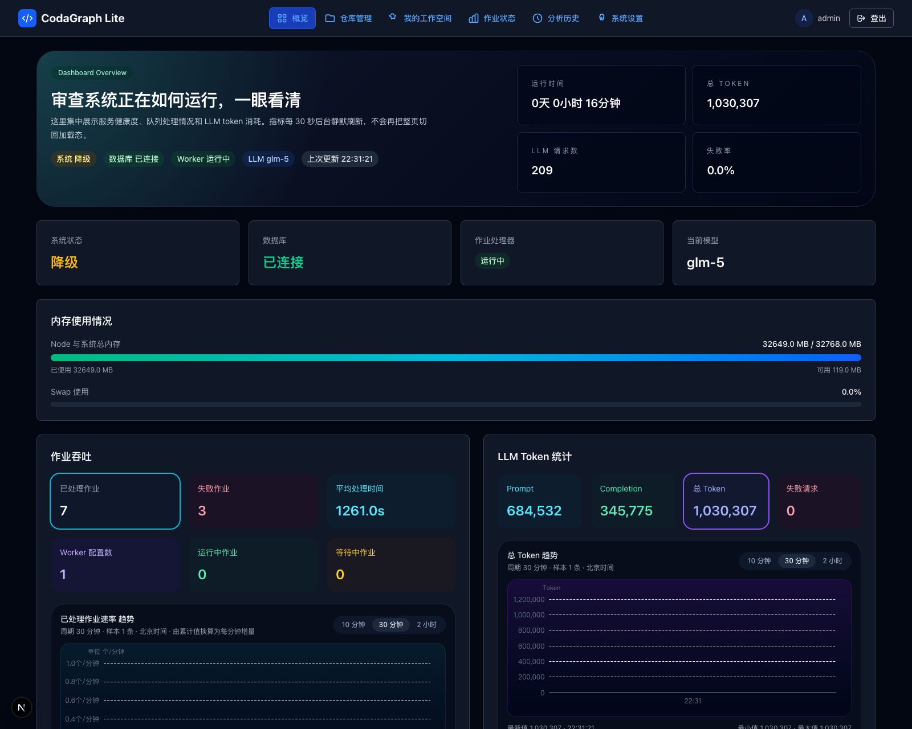
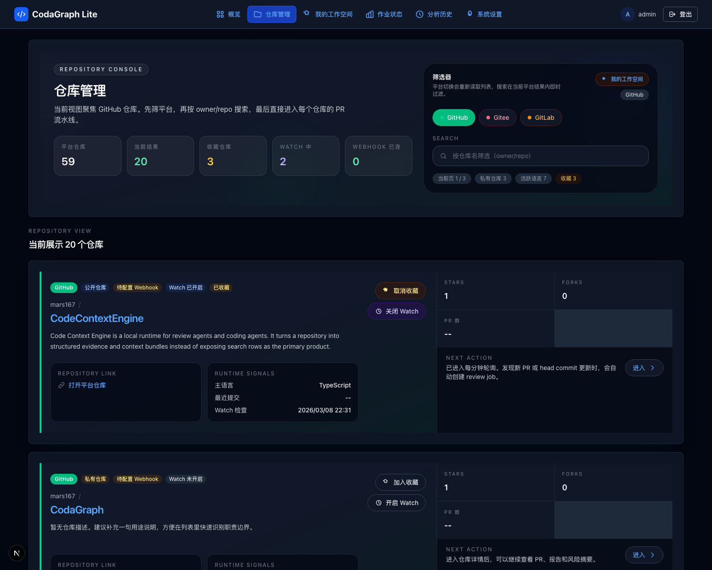
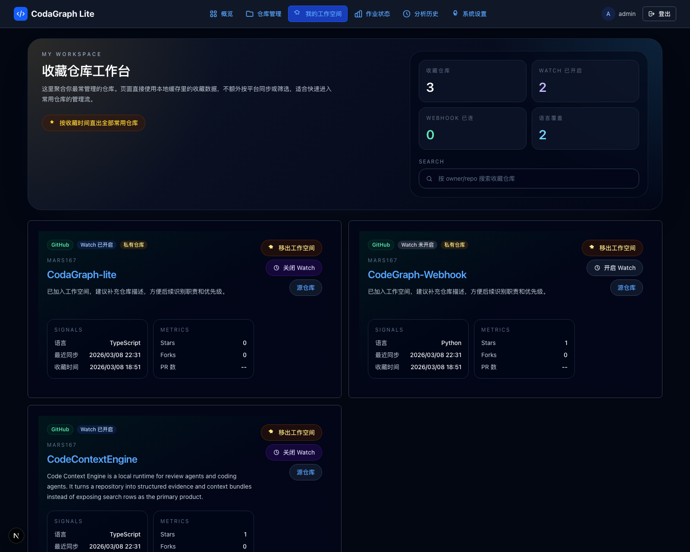
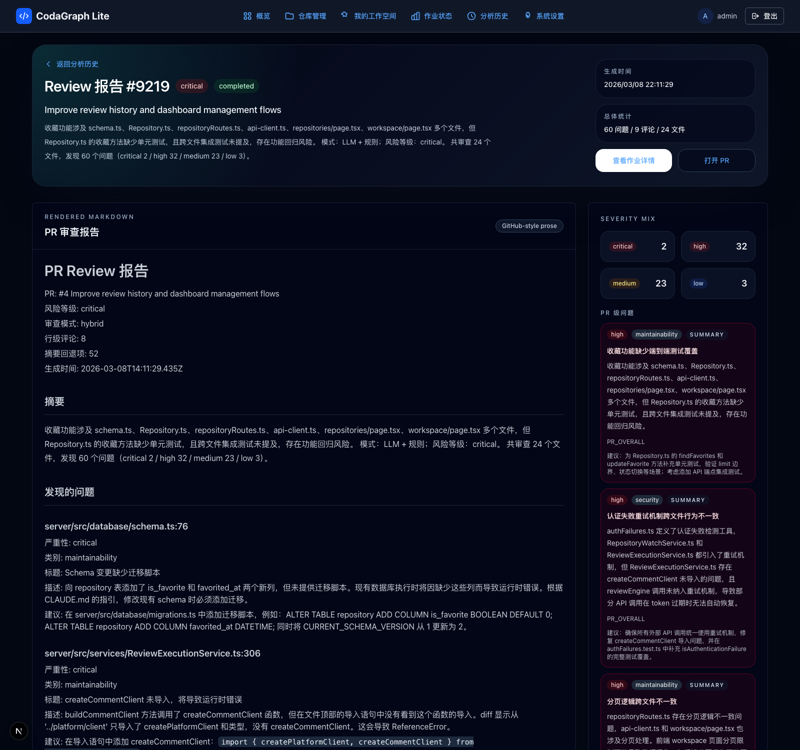

# CodaGraph-lite

<div align="center">


**本地优先的 AI Code Review 平台**

高信号审查、可控成本、可替换 LLM API

</div>

---

## 目录

- [项目简介](#项目简介)
- [核心特性](#核心特性)
- [页面预览](#页面预览)
- [技术栈](#技术栈)
- [为什么适合日常 Review](#为什么适合日常-review)
- [快速开始](#快速开始)
- [系统要求](#系统要求)
- [项目结构](#项目结构)
- [功能演示](#功能演示)
- [配置说明](#配置说明)
- [部署指南](#部署指南)
- [故障排除](#故障排除)
- [架构文档](#架构文档)
- [贡献指南](#贡献指南)
- [升级指南](#升级指南)

---

## 项目简介

CodaGraph-lite 是一个面向个人开发者和小团队的 local-first 代码审查平台。你可以把它直接部署在本地或私有环境里，用自己的 Git 平台凭据、自己的 LLM API 和自己的运行策略完成日常 PR review，而不需要一套复杂的外部基础设施。

它保留了 CodaGraph 的核心审查能力，但把产品重心从“更重的服务编排”切到“更高信号的审查输出 + 更低的接入和运行成本”。这也更贴近 [Anthropic 在 Code Review with Claude 一文](https://claude.com/blog/code-review) 里强调的方向：真正有价值的 review，重点是快速指出值得人判断的风险，而不是把 diff 再复述一遍。

### 与完整版 CodaGraph 的区别

| 特性 | CodaGraph | CodaGraph-lite |
|--------|-----------|----------------|
| 服务数量 | 5 个独立服务 | 2 个服务（前端+后端） |
| 数据库 | PostgreSQL + Redis | SQLite（单文件） |
| 消息队列 | Bull Queue + Redis | 自研 SQLite 队列 |
| 用户系统 | 多用户 + RBAC | 单管理员 |
| 部署要求 | Docker Compose | 本地直接运行或 systemd/PM2 |
| 审查模型 | 固定平台配置 | OpenAI / Anthropic / DeepSeek / OpenAI-compatible |
| 成本控制 | 依赖完整基础设施 | 可自选模型、Base URL 与重试策略 |
| 适用场景 | 企业 SaaS | 本地 / 私有环境 / 小团队日常 Review |

---

## 核心特性

### 高信号审查
- 集成 **Code Context Engine** 做语义分析，而不是只看 patch 文本
- 输出审查摘要、风险等级、覆盖率、置信度和下一步动作
- 支持行级评论与报告页联动，优先展示真正影响合并决策的问题

### 本地优先
- **双服务架构**：前端 (Next.js 14) + 后端 (Express.js)
- **零外部依赖数据库**：SQLite 单文件存储，无需 PostgreSQL / Redis
- 审查数据、仓库令牌和运行日志都可以留在你自己的环境里

### 成本可控
- 默认单 Worker 串行处理，避免 review 任务把本地机器或小型服务器拖垮
- 审查运行时内置在后端进程中，减少额外服务和维护成本
- 可以按仓库和团队习惯选择更便宜、更快或更强的模型

### 可替换 LLM API
- 支持 **OpenAI、Anthropic、DeepSeek**
- 支持 **OpenAI-compatible Base URL**
- 可以接自建代理、网关或兼容接口，方便统一成本与权限管理

### Web 管理界面
- 直观的仪表板界面
- OAuth 集成管理（GitHub/Gitee/GitLab）
- 仓库管理与 Watch 状态查看
- 审查历史、作业状态和 LLM 调用情况集中展示

---

## 页面预览

以下截图来自本地运行中的真实页面，用于展示当前版本的后台界面和报告体验。

<table>
  <tr>
    <td width="50%">
      
      <p align="center"><strong>系统概览</strong><br>查看作业吞吐、LLM Token、资源状态和运行模型。</p>
    </td>
    <td width="50%">
      
      <p align="center"><strong>仓库管理</strong><br>集中管理接入仓库、Watch 状态、Webhook 和下一步动作。</p>
    </td>
  </tr>
  <tr>
    <td width="50%">
      
      <p align="center"><strong>我的工作空间</strong><br>按收藏仓库聚合日常关注对象，直接进入单仓库管理和 Watch 操作。</p>
    </td>
    <td width="50%">
      
      <p align="center"><strong>Review 报告</strong><br>渲染 Markdown 摘要、风险分布和 GitHub 风格的问题明细。</p>
    </td>
  </tr>
</table>

---

## 技术栈

### 前端
- **框架**: Next.js 14 (App Router)
- **UI 库**: React 18 + Tailwind CSS
- **状态管理**: React Context API
- **HTTP 客户端**: fetch API

### 后端
- **框架**: Express.js
- **语言**: TypeScript
- **数据库**: SQLite3 (better-sqlite3)
- **作业队列**: 自研 SQLite 队列
- **认证**: Session-based + 密码哈希

### AI 服务
- **Context Agent**: Python 3.11+ (gRPC)
- **Review Runtime**: `server/src/review/*` 内进程执行
- **代码分析**: Code Context Engine runtime
- **LLM 支持**: OpenAI, Anthropic, DeepSeek 等

### 部署
- **进程管理**: systemd / PM2
- **日志**: Winston + 结构化日志
- **监控**: 内置健康检查和指标端点

---

## 为什么适合日常 Review

CodaGraph-lite 的重点不是“让 AI 多说一些”，而是让审查输出更接近真实协作中的高价值反馈：先告诉你哪里危险，再给足够少但足够具体的 comment，最后把是否合并留给人判断。

| 优势 | 具体体现 |
|------|----------|
| 本地优先 | 可以跑在本机、内网或私有云中，把代码、令牌和审查记录留在自己的环境里 |
| 高信号输出 | 报告会展示风险等级、覆盖率、置信度、next actions，并优先发布更有影响的问题 |
| 成本可控 | SQLite + 内置队列 + 单 Worker 默认策略，基础设施和日常 review 成本都更低 |
| 模型可替换 | 可在 OpenAI、Anthropic、DeepSeek 和 OpenAI-compatible API 之间切换 |
| 人机协作 | AI 给 overview、inline comment 和 trace，人负责最终判断与合并 |

### 运行时可观测性

系统内置以下监控端点：

- `/api/status/memory` - 内存使用报告
- `/api/status/resources` - 完整资源状态
- `/health` - 服务健康检查
- 95% (1.9GB) → 停止接受新作业

---

## 快速开始

### 1. 克隆项目

```bash
git clone https://github.com/your-org/codagraph-lite.git
cd codagraph-lite
```

### 2. 安装依赖

```bash
# 安装 Node.js 依赖（前端 + 后端）
npm install

# 安装 Python 依赖
cd context-agent && pip install -r requirements.txt && cd ..
```

### 3. 配置环境变量

```bash
# 复制示例配置
cp .env.example .env

# 编辑配置文件
nano .env
```

**必须配置项**：
- `ADMIN_USERNAME` - 管理员用户名
- `ADMIN_PASSWORD` - 管理员密码
- `LLM_PROVIDER` - LLM 提供商
- `LLM_API_KEY` - LLM API 密钥
- `CODE_CONTEXT_ENGINE_ROOT` - Code Context Engine runtime 路径

### 4. 安装 Code Context Engine runtime

```bash
# 推荐：将 CodeContextEngine runtime 放到项目同级目录
git clone <your-code-context-engine-repo> ../CodeContextEngine
npm --prefix ../CodeContextEngine install
npm --prefix ../CodeContextEngine run build

# 可选：安装 CLI 便于本地调试
npm install -g code-context-engine
```

### 5. 启动服务

**开发模式**（前端 + 后端同时启动）：
```bash
npm run dev
```

**快速后台启动/重启**：
```bash
# 后台启动（日志写入 .run/dev.log）
npm run service:start

# 停止服务
npm run service:stop

# 重启服务
npm run service:restart

# 重置管理员密码（默认使用 .env 的 ADMIN_USERNAME / ADMIN_PASSWORD）
npm run admin:password:reset

# 指定用户名和新密码
bash ./bin/admin-password-reset.sh admin NewStrongPassword123
```

**生产模式**：
```bash
# 构建前端
cd web && npm run build && cd ..

# 启动服务
npm run start
```

### 6. 访问应用

| 服务 | 地址 | 说明 |
|------|------|------|
| 前端界面 | http://localhost:3000 | 管理仪表板 |
| 后端 API | http://localhost:7900 | RESTful API |
| 健康检查 | http://localhost:7900/health | 服务状态 |

### 7. 初始化管理员账户

首次访问 `http://localhost:3000`，系统会引导你：
1. 创建管理员账户
2. 配置 LLM 提供商
3. 授权 Git 平台（GitHub/Gitee/GitLab）

---

## 系统要求

### 最低配置（本地 / 单机）

| 资源 | 要求 | 说明 |
|------|------|------|
| CPU | 2 核心 | 支持虚拟化云服务器 |
| 内存 | 2GB RAM | 本地调试或小团队使用通常足够 |
| 磁盘 | 10GB 可用空间 | 包含数据库和日志 |
| 操作系统 | Linux (Ubuntu 20.04+) | 也支持 macOS / Windows |
| 网络 | 公网 IP | 用于 Webhook 回调 |

### 软件依赖

```bash
# Node.js 版本
node --version  # 18.0.0 或更高

# Python 版本
python --version  # 3.11 或更高

# Code Context Engine runtime（CLI 仅用于调试）
code-context-engine --version
```

### 推荐配置

| 资源 | 推荐 | 说明 |
|------|------|------|
| CPU | 2-4 核心 | 更快的 LLM 处理 |
| 内存 | 4GB RAM | 无需 Swap，更稳定 |
| 磁盘 | 20GB+ SSD | 更快的数据库访问 |

---

## 项目结构

```
codagraph-lite/
├── web/                    # Next.js 前端应用
│   ├── app/               # App Router 页面
│   ├── components/         # React 组件
│   └── lib/               # 工具函数
├── server/                  # Express.js 后端服务
│   ├── src/               # 源代码
│   │   ├── database/      # SQLite 数据库层
│   │   ├── queue/          # 作业队列
│   │   ├── routes/         # API 路由
│   │   ├── services/       # 业务逻辑
│   │   └── review/         # Review runtime / prompt / report modules
│   └── tests/            # 单元测试
├── context-agent/          # Python Context Agent
│   ├── src/
│   └── tests/
├── proto/                 # gRPC 协议定义
├── deploy/                # 部署脚本
│   ├── *.service          # systemd 服务文件
│   └── ecosystem.config.js # PM2 配置
├── docs/                 # 项目文档
├── data/                 # SQLite 数据库文件
├── logs/                 # 日志文件
└── .env.example          # 环境变量示例
```

---

## 功能演示

### 1. 管理员登录

首次使用时创建管理员账户，后续使用用户名/密码登录。

### 2. OAuth 集成

一键授权连接到：
- **GitHub** - 点击"授权 GitHub"按钮
- **Gitee** - 点击"授权 Gitee"按钮
- **GitLab** - 点击"授权 GitLab"按钮

授权后系统自动配置 Webhook。

### 3. 仓库管理

查看已连接的仓库列表：
- 平台图标
- 仓库路径
- 最后审查时间
- 连接/断开操作

### 4. PR 审查流程

1. 开发者在 Git 平台创建/更新 Pull Request
2. Webhook 触发 CodaGraph-lite 后端
3. 作业入队等待处理
4. Worker 克隆仓库到工作区
5. 初始化 Code Context Engine runtime 并收集检索上下文
6. 启动 Context Agent 收集上下文
7. 在后端进程内运行 Review Runtime 执行审查
8. 格式化审查评论
9. 发布评论到原平台

### 5. 作业监控

实时查看：
- 当前处理中的作业
- 队列中的待处理作业
- 作业历史和状态
- 错误信息和重试次数

### 6. 资源监控

查看实时：
- 内存使用（总量/各进程）
- CPU 使用率
- 磁盘使用
- Swap 使用情况

---

## 配置说明

详细配置说明请参考：

- [配置指南](docs/configuration.md) - 完整环境变量说明
- [.env.example](.env.example) - 配置示例文件

### 关键配置速查

| 配置项 | 默认值 | 说明 |
|--------|---------|------|
| `ADMIN_USERNAME` | `admin` | 管理员用户名 |
| `ADMIN_PASSWORD` | `changeme` | 管理员密码（必须更改） |
| `WORKER_COUNT` | `1` | 默认单 Worker，运行更可预测、成本更可控 |
| `LLM_PROVIDER` | `openai` | LLM 提供商 |
| `LLM_API_KEY` | - | LLM API 密钥 |
| `CODE_CONTEXT_ENGINE_ROOT` | `../CodeContextEngine` | Code Context Engine runtime 路径 |

---

## 部署指南

详细的部署说明请参考：

- [部署指南](docs/deployment.md) - 完整部署步骤
- [systemd 配置](docs/deployment.md#使用-systemd) - 系统服务部署
- [PM2 配置](docs/deployment.md#使用-pm2) - 进程管理部署
- [低成本部署建议](docs/deployment.md#低成本部署建议) - 本地 / 单机运行建议

### 部署脚本

CodaGraph-lite 提供完整的部署脚本，位于 `deploy/` 目录：

| 脚本 | 功能 | 使用方式 |
|------|------|---------|
| `deploy.sh` | 一键部署 | `sudo bash deploy/deploy.sh [systemd\|pm2]` |
| `uninstall.sh` | 完全卸载 | `sudo bash deploy/uninstall.sh [--remove-data]` |
| `verify.sh` | 部署验证 | `bash deploy/verify.sh [--verbose]` |
| `validate-env.sh` | 环境变量验证 | `bash deploy/validate-env.sh [--strict] [--fix]` |
| `setup-swap.sh` | Swap 配置（2GB） | `sudo bash deploy/setup-swap.sh` |
| `backup.sh` | 数据备份 | `bash deploy/backup.sh [--full]` |
| `restore.sh` | 数据恢复 | `sudo bash deploy/restore.sh <backup_file>` |
| `monitor.sh` | 系统监控 | `bash deploy/monitor.sh [--continuous]` |

### 快速部署（systemd）

```bash
# 1. 一键部署（推荐）
sudo bash deploy/deploy.sh systemd

# 2. 或手动部署
npm install
cd context-agent && pip install -r requirements.txt && cd ..
# Review Runtime 已内置在 server 中，不需要单独安装 review-agent
cp .env.example .env
nano .env  # 编辑配置
cd web && npm run build && cd ..
sudo cp deploy/*.service /etc/systemd/system/
sudo systemctl daemon-reload
sudo systemctl enable --now codagraph-lite-backend codagraph-lite-frontend
```

### 系统监控

```bash
# 单次检查
bash deploy/monitor.sh

# 持续监控（按 Ctrl+C 退出）
bash deploy/monitor.sh --continuous --interval=5
```

监控显示内容包括：
- 系统信息（主机、操作系统、运行时间）
- CPU 使用率和负载
- 内存使用率（RAM + Swap）
- 磁盘使用情况
- 服务状态（前端/后端）
- 进程信息（Node.js / Python）
- 运行时约束检查
- 作业队列状态
- 告警信息

---

## 故障排除

常见问题和解决方案请参考：

- [故障排除指南](docs/troubleshooting.md)

### 常见问题速查

| 问题 | 可能原因 | 解决方案 |
|------|-----------|---------|
| 服务无法启动 | 端口被占用 | 检查 `FRONTEND_PORT` / `BACKEND_PORT` |
| OAuth 失败 | 回调 URL 错误 | 检查 `*_CALLBACK_URL` 配置 |
| 内存不足 (OOM) | Worker 数量过多 | 确保 `WORKER_COUNT=1` |
| Agent 超时 | 仓库过大 | 增加 `AGENT_TIMEOUT_*` 值 |
| 数据库锁定 | SQLite 文件损坏 | 运行数据库恢复或从备份恢复 |

---

## 架构文档

详细的架构说明请参考：

- [架构文档](docs/architecture.md) - 系统设计和数据流

### 架构概览

```
┌─────────────────────────────────────────────────────────────┐
│                   浏览器/客户端                         │
└────────────────────┬────────────────────────────────────────┘
                 │ HTTPS
┌────────────────▼────────────────────────────────────────┐
│                  Next.js 前端                   │
│            (端口 3000, 静态文件)            │
└────────────────┬────────────────────────────────────────┘
                 │ HTTP API
┌────────────────▼────────────────────────────────────────┐
│               Express.js 后端                      │
│     (端口 7900, API + Worker)               │
│                                                  │
│  ┌────────────┬──────────┬───────────┐       │
│  │ SQLite 数据库 │ 作业队列  │ Auth 中间件│       │
│  └────────────┴──────────┴───────────┘       │
│                                                  │
│  ┌──────────────┬────────────────────────┐        │
│  │ gRPC 客户端   │ In-process Review     │        │
│  │ (Context)    │ Runtime (`src/review`)│        │
│  └──────┬───────┴───────────┬────────────┘        │
│         │                   │                     │
│  ┌──────▼──────┐    ┌──────▼──────────┐          │
│  │Context Agent │    │ Review Runtime  │          │
│  │Python 3.11+  │    │ Node.js 进程内  │          │
│  │ (临时进程)    │    │ 执行与发布评论  │          │
│  └──────┬───────┘    └──────┬──────────┘          │
│         │                   │                     │
│         └─────────┬─────────┘                    │
│                   ▼                              │
│            Code Context Engine runtime (索引)                    │
└────────────────────────────────────────────────────────┘

           外部平台
    ┌────────┬────────┬────────┐
    │GitHub  │ Gitee  │GitLab │
    │OAuth+  │ OAuth+ │ OAuth+ │
    │Webhook │ Webhook │Webhook │
    └────────┴────────┴────────┘
```

---

## 贡献指南

欢迎贡献！请参考：

- [贡献指南](docs/contributing.md)

### 开发流程

1. Fork 项目
2. 创建功能分支 (`git checkout -b feature/AmazingFeature`)
3. 提交更改 (`git commit -m 'Add some AmazingFeature'`)
4. 推送到分支 (`git push origin feature/AmazingFeature`)
5. 开启 Pull Request

### 代码规范

- **JavaScript/TypeScript**: ESLint + Prettier
- **Python**: Black + Ruff + MyPy
- **提交信息**: Conventional Commits 格式

---

## 升级指南

详细的升级说明请参考：

- [升级指南](docs/upgrade.md) - 版本升级步骤

### 升级检查清单

- [ ] 备份数据库文件
- [ ] 备份 `.env` 配置
- [ ] 停止服务
- [ ] 拉取最新代码
- [ ] 安装新依赖
- [ ] 运行数据库迁移
- [ ] 启动服务
- [ ] 验证功能正常

---

## 文档索引

| 文档 | 说明 |
|------|------|
| [配置指南](docs/configuration.md) | 完整环境变量说明 |
| [部署指南](docs/deployment.md) | 部署步骤和优化 |
| [故障排除](docs/troubleshooting.md) | 常见问题解决方案 |
| [架构文档](docs/architecture.md) | 系统架构设计 |
| [API 文档](docs/api.md) | RESTful API 参考 |
| [贡献指南](docs/contributing.md) | 开发和贡献流程 |
| [升级指南](docs/upgrade.md) | 版本升级步骤 |

---

## 许可证

[MIT License](LICENSE)

---

## 支持

- 📖 [文档中心](docs/)
- 🐛 [问题反馈](https://github.com/your-org/codagraph-lite/issues)
- 💬 [讨论区](https://github.com/your-org/codagraph-lite/discussions)
- 📧 邮件支持: support@codagraph.com

---

<div align="center">

**让代码审查更简单，更高效**

Made with ❤️ by the CodaGraph team

</div>
