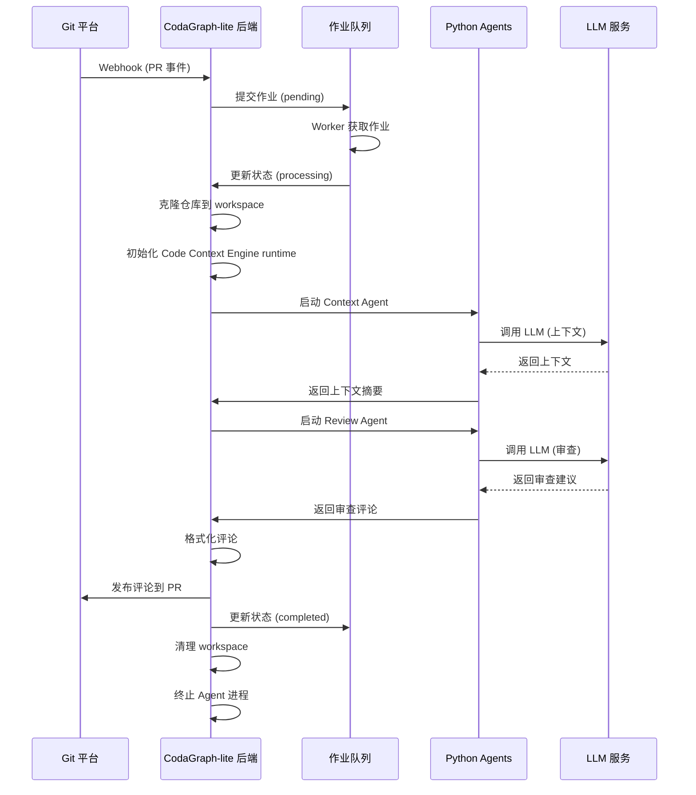
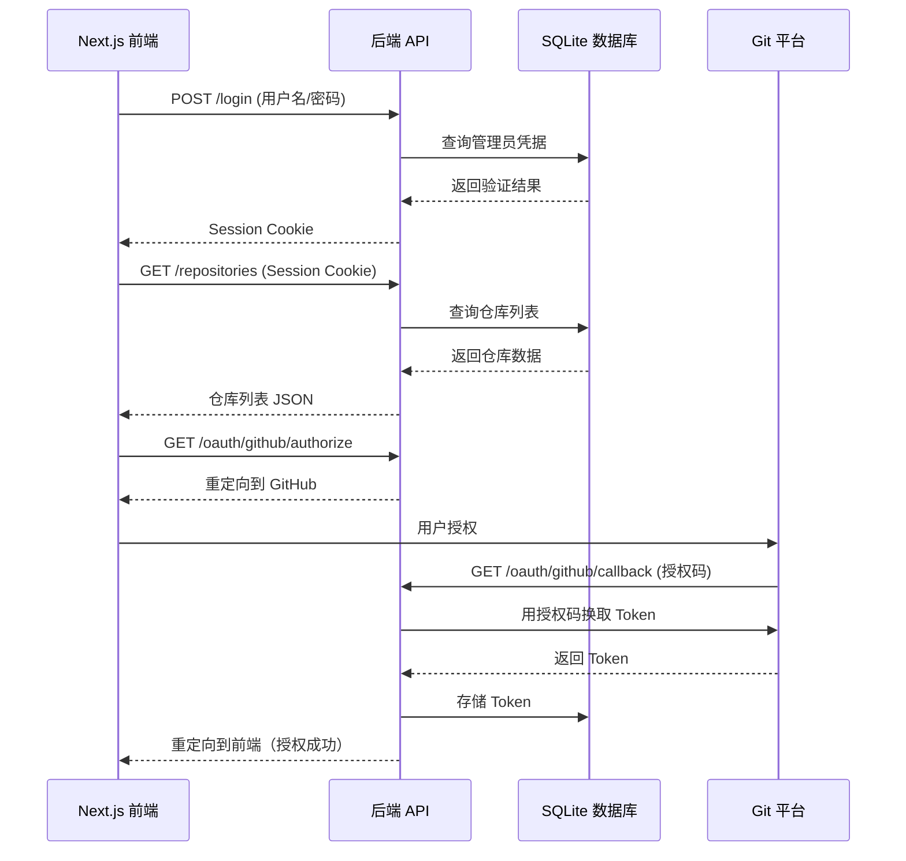

# CodaGraph-lite 架构文档

> Historical note: sections that mention a standalone gRPC review-agent describe an older design and are not part of the active review pipeline anymore.

本文档详细说明 CodaGraph-lite 的系统架构、数据流和技术实现。

## 目录

- [架构概述](#架构概述)
- [双服务架构](#双服务架构)
- [数据库层](#数据库层)
- [作业队列系统](#作业队列系统)
- [认证系统](#认证系统)
- [OAuth 集成](#oauth-集成)
- [代码审查管道](#代码审查管道)
- [Python Agent 集成](#python-agent-集成)
- [2u2g 资源优化](#2u2g-资源优化)
- [数据流](#数据流)
- [部署架构](#部署架构)

---

## 架构概述

CodaGraph-lite 采用简化的双服务架构，专为 2u2g 服务器优化。

### 设计原则

1. **轻量级** - 最小化资源占用和依赖
2. **可靠性** - 确保数据持久化和错误恢复
3. **可维护性** - 模块化设计，易于调试和扩展
4. **安全性** - 防护敏感数据和外部攻击

### 系统组件

```
┌─────────────────────────────────────────────────────────────┐
│                   用户界面层                        │
└────────────────────┬────────────────────────────────────────┘
                 │ HTTPS
┌────────────────▼────────────────────────────────────────┐
│              CodaGraph-lite 系统                   │
│                                                  │
│  ┌──────────────────┬─────────────────────┐          │
│  │   前端服务      │    后端服务      │          │
│  │  (Next.js 14)    │    (Express.js)    │          │
│  └────────┬──────────┴──────┬──────────┘          │
│           │                    │                         │
│  ┌────────▼──────────┐  ┌──▼──────────┐          │
│  │  认证中间件    │  │  API 路由    │          │
│  └────────┬──────────┘  └──┬──────────┘          │
│           │                   │                         │
│  ┌────────▼──────────┐  ┌──▼──────────┐          │
│  │  业务服务层      │  │  作业队列     │          │
│  └────────┬──────────┘  └──┬──────────┘          │
│           │                   │                         │
│  ┌────────▼──────────┐  ┌──▼──────────┐          │
│  │   数据库层      │  │  Agent 集成 │          │
│  │   (SQLite)      │  │              │          │
│  └────────┬──────────┘  └──┬──────────┘          │
│           │                   │                         │
│  ┌────────▼──────────┐  ┌──▼──────────┐          │
│  │  SQLite 数据库   │  │ gRPC 客户端 │          │
│  └──────────────────┘  └──┬──────────┘          │
│                             │                         │
│              ┌──────────────▼────────────┐               │
│              │   外部集成层              │               │
│  ┌───────┬────┴──────┬────────┐               │
│  │Code Context Engine │ Context   │Review   │               │
│  │ CLI    │ Agent     │ Agent   │               │
│  └─────────┴────────────┴─────────┘               │
└────────────────────────────────────────────────────────────────┘

              外部平台服务
    ┌────────┬────────┬────────┐
    │ GitHub │ Gitee  │GitLab │
    │ OAuth+ │ OAuth+ │ OAuth+ │
    │ Webhook│ Webhook │Webhook │
    └────────┴────────┴────────┘
```

---

## 双服务架构

### 前端服务（Next.js）

**技术栈**：
- 框架：Next.js 14 (App Router)
- 语言：TypeScript
- UI 库：React 18 + Tailwind CSS
- 状态管理：React Context API
- HTTP 客户端：Fetch API

**职责**：
- 提供用户界面和管理仪表板
- 客户端路由和页面渲染
- 与后端 API 通信
- 处理用户认证和授权

**目录结构**：
```
web/
├── app/                  # Next.js App Router
│   ├── layout.tsx         # 根布局
│   ├── login/             # 登录页面
│   ├── dashboard/         # 仪表板
│   ├── oauth/             # OAuth 授权页面
│   ├── repositories/       # 仓库管理
│   ├── jobs/              # 作业监控
│   └── analyses/          # 分析历史
├── components/           # React 组件
│   ├── Layout/
│   ├── Dashboard/
│   ├── RepositoryCard/
│   └── ...
├── lib/                  # 工具函数
│   ├── api.ts            # API 客户端
│   └── auth.ts           # 认证工具
└── public/               # 静态资源
```

### 后端服务（Express.js）

**技术栈**：
- 框架：Express.js
- 语言：TypeScript
- 数据库：SQLite (better-sqlite3)
- 作业队列：自研 SQLite 队列
- 认证：Session-based

**职责**：
- 提供 RESTful API
- 处理作业队列
- 管理 SQLite 数据库
- 集成 Python Agent
- 处理 Webhook 事件

**目录结构**：
```
server/
├── src/
│   ├── index.ts          # 服务入口
│   ├── routes/           # API 路由
│   │   ├── auth.ts
│   │   ├── oauth.ts
│   │   ├── repositories.ts
│   │   ├── jobs.ts
│   │   └── ...
│   ├── services/         # 业务逻辑
│   │   ├── AuthService.ts
│   │   ├── OAuthService.ts
│   │   ├── JobService.ts
│   │   └── ...
│   ├── database/         # 数据库层
│   │   ├── connection.ts
│   │   ├── models.ts
│   │   └── queries.ts
│   ├── queue/            # 作业队列
│   │   ├── Queue.ts
│   │   └── Worker.ts
│   └── agents/           # Agent 集成
│       ├── ContextAgent.ts
│       └── ReviewAgent.ts
└── tests/              # 单元测试
```

---

## 数据库层

### SQLite 数据库

**驱动**：`better-sqlite3`

**优势**：
- 零配置，单文件数据库
- 轻量级（约 500KB 基础内存）
- ACID 合规
- 跨平台

**配置**：
- WAL 模式：提升并发性能
- 缓存大小：2u2g 优化为 2MB
- 连接池：管理数据库连接

### 数据库 Schema

```sql
-- 安装表（OAuth 凭据存储）
CREATE TABLE installation (
    id INTEGER PRIMARY KEY AUTOINCREMENT,
    platform TEXT NOT NULL,           -- github, gitee, gitlab
    platform_id TEXT,                  -- 平台上的用户 ID
    account TEXT NOT NULL,              -- 平台账户名
    access_token TEXT NOT NULL,         -- 访问令牌
    refresh_token TEXT,                -- 刷新令牌（如适用）
    expires_at DATETIME,                -- 令牌过期时间
    created_at DATETIME NOT NULL DEFAULT CURRENT_TIMESTAMP
);

-- 仓库表
CREATE TABLE repository (
    id INTEGER PRIMARY KEY AUTOINCREMENT,
    installation_id INTEGER NOT NULL,       -- 外键到 installation
    platform TEXT NOT NULL,
    owner TEXT NOT NULL,
    repo TEXT NOT NULL,
    url TEXT NOT NULL,
    is_connected BOOLEAN NOT NULL DEFAULT 1,
    webhook_enabled BOOLEAN DEFAULT 0,
    webhook_url TEXT,
    default_branch TEXT,
    last_analysis_at DATETIME,
    FOREIGN KEY (installation_id) REFERENCES installation(id)
);

-- 分析表（PR 审查结果）
CREATE TABLE analysis (
    id INTEGER PRIMARY KEY AUTOINCREMENT,
    repository_id INTEGER NOT NULL,        -- 外键到 repository
    platform TEXT NOT NULL,
    owner TEXT NOT NULL,
    repo TEXT NOT NULL,
    pr_number INTEGER NOT NULL,
    pr_title TEXT,
    pr_url TEXT NOT NULL,
    status TEXT NOT NULL,               -- pending, processing, completed, failed
    context_summary TEXT,
    review_summary TEXT,
    comments_count INTEGER DEFAULT 0,
    files_reviewed INTEGER DEFAULT 0,
    issues_found TEXT,                   -- JSON 存储
    duration INTEGER,                     -- 毫秒
    created_at DATETIME NOT NULL DEFAULT CURRENT_TIMESTAMP,
    started_at DATETIME,
    completed_at DATETIME,
    FOREIGN KEY (repository_id) REFERENCES repository(id)
);

-- 作业表（队列表）
CREATE TABLE job (
    id INTEGER PRIMARY KEY AUTOINCREMENT,
    type TEXT NOT NULL,                   -- context_analysis, code_review
    platform TEXT NOT NULL,
    owner TEXT NOT NULL,
    repo TEXT NOT NULL,
    pr_number INTEGER,
    status TEXT NOT NULL DEFAULT 'pending',  -- pending, processing, completed, failed, dead
    payload TEXT,                         -- JSON 存储
    progress INTEGER DEFAULT 0,            -- 0-100 百分比
    stage TEXT,                           -- 当前阶段
    attempts INTEGER DEFAULT 0,
    error_message TEXT,
    created_at DATETIME NOT NULL DEFAULT CURRENT_TIMESTAMP,
    started_at DATETIME,
    completed_at DATETIME,
    failed_at DATETIME
);

-- Webhook 事件表
CREATE TABLE webhook_event (
    id INTEGER PRIMARY KEY AUTOINCREMENT,
    platform TEXT NOT NULL,
    event_type TEXT NOT NULL,             -- pull_request, push, etc.
    payload TEXT,
    processed_at DATETIME,
    created_at DATETIME NOT NULL DEFAULT CURRENT_TIMESTAMP
);

-- 使用指标表
CREATE TABLE usage_metric (
    id INTEGER PRIMARY KEY AUTOINCREMENT,
    metric_type TEXT NOT NULL,           -- jobs_completed, llm_calls, etc.
    metric_value REAL NOT NULL,
    unit TEXT,
    recorded_at DATETIME NOT NULL DEFAULT CURRENT_TIMESTAMP
);

-- 索引
CREATE INDEX idx_analysis_repository ON analysis(repository_id);
CREATE INDEX idx_job_status ON job(status, created_at);
CREATE INDEX idx_webhook_platform ON webhook_event(platform, created_at);
```

### 数据库连接池

```typescript
// 连接池配置
const poolConfig = {
    max: 10,              // 最大连接数
    idleTimeoutMillis: 30000,  // 空闲超时 30 秒
    acquireTimeoutMillis: 60000  // 获取超时 60 秒
};

// 连接获取
const db = pool.acquire();

// 连接释放
pool.release(db);
```

---

## 作业队列系统

### SQLite 队列

基于 SQLite 的轮询式作业队列。

**作业状态流转**：
```
pending → processing → completed
         ↓
       failed
         ↓
       dead (retry limit exceeded)
```

### 队列 Worker

```typescript
// Worker 轮询逻辑
class QueueWorker {
    private pollInterval: number = 2000;  // 2 秒
    private maxAttempts: number = 3;

    async start(): Promise<void> {
        while (this.isRunning) {
            // 1. 获取待处理作业
            const job = await this.queue.getNextJob();

            if (!job) {
                await this.sleep(this.pollInterval);
                continue;
            }

            // 2. 更新状态为 processing
            await this.queue.updateStatus(job.id, 'processing');

            // 3. 处理作业
            try {
                await this.processJob(job);
                await this.queue.updateStatus(job.id, 'completed');
            } catch (error) {
                await this.handleFailure(job, error);
            }
        }
    }
    }

    private async processJob(job: Job): Promise<void> {
        switch (job.type) {
            case 'context_analysis':
                await this.runContextAgent(job);
                break;
            case 'code_review':
                await this.runReviewAgent(job);
                break;
        }
    }

    private async handleFailure(job: Job, error: Error): Promise<void> {
        job.attempts++;

        if (job.attempts < this.maxAttempts) {
            // 指数退避重试
            const delay = Math.pow(2, job.attempts) * 1000;
            await this.queue.updateStatus(job.id, 'pending');
            await this.sleep(delay);
        } else {
            // 超过重试次数，移入死信队列
            await this.queue.updateStatus(job.id, 'dead');
        }
    }
}
```

### 单 Worker 限制（2u2g 优化）

```typescript
// 配置验证
const validateConfig = (): boolean => {
    if (process.env.WORKER_COUNT !== '1') {
        throw new Error('2u2g 服务器必须设置 WORKER_COUNT=1');
    }
    if (process.env.ENABLE_CONCURRENT_JOBS !== 'false') {
        throw new Error('2u2g 服务器必须禁用并发作业');
    }
    return true;
};
```

---

## 认证系统

### Session-based 认证

```typescript
// Session 结构
interface Session {
    id: string;              // UUID
    userId: number;          // 管理员 ID
    username: string;
    createdAt: Date;
    expiresAt: Date;
    isValid: boolean;
}
```

### 认证流程

```
1. 用户输入用户名和密码
2. 后端验证凭据
3. 生成 Session ID（UUID）
4. 设置 Session Cookie
5. 后续请求携带 Session Cookie
6. 中间件验证 Session 有效性
7. Session 过期后重定向到登录页
```

### 密码哈希

```typescript
import bcrypt from 'bcrypt';

// 哈希密码（10 轮次）
const hashPassword = async (password: string): Promise<string> => {
    const salt = await bcrypt.genSalt(10);
    const hash = await bcrypt.hash(password, salt);
    return hash;
};

// 验证密码
const verifyPassword = async (
    password: string,
    hash: string
): Promise<boolean> => {
    return await bcrypt.compare(password, hash);
};
```

---

## OAuth 集成

### OAuth 流程

```
用户                      平台                      后端
 │                         │                         │
 │   1. 点击授权按钮     │                         │
 │                         │                         │
 ▼                         │                         │
─────────────────────────────────────────────┐
│  平台授权页面                  │
│  2. 用户确认授权           │
└────────────┬─────────────────────────────┘
             │ 3. 回调授权码
             ▼
      ┌──────────────────────────────┐
      │ 后端处理回调         │
      │ 4. 用授权码换取 Token  │
      │ 5. 存储 Token 到数据库   │
      │ 6. 设置 Session Cookie   │
      └────────────┬─────────────────┘
                   │ 7. 重定向到前端
                   ▼
         ┌───────────────────────┐
         │  前端显示已授权    │
         └───────────────────────┘
```

### Token 存储

```typescript
// Installation 表存储
interface Installation {
    id: number;
    platform: 'github' | 'gitee' | 'gitlab';
    platform_id: string;              // 平台用户 ID
    account: string;                  // 账户名
    access_token: string;              // 访问令牌
    refresh_token?: string;             // 刷新令牌
    expires_at: Date;                 // 过期时间
}
```

### Webhook 签名验证

```typescript
import crypto from 'crypto';

// 验证 GitHub webhook 签名
const verifyGitHubWebhook = (
    payload: string,
    signature: string,
    secret: string
): boolean => {
    const expectedSignature = crypto
        .createHmac('sha256', secret)
        .update(payload)
        .digest('hex');

    const receivedSignature = `sha256=${signature}`;
    return crypto.timingSafeEqual(expectedSignature, receivedSignature);
};
```

---

## 代码审查管道

### 完整流程

```
┌────────────────────────────────────────────────────────────────┐
│  1. 平台 Webhook 触发                        │
│  (PR opened/synchronized)                          │
└──────────────────────┬─────────────────────────────────────────┘
                     │
                     ▼
        ┌──────────────────────────────────────┐
        │  2. 后端接收 Webhook       │
        │  - 验证签名                │
        │  - 解析 PR 信息             │
        │  - 提交作业到队列         │
        └────────────┬───────────────────────────┘
                     │
                     ▼
        ┌──────────────────────────────────────┐
        │  3. Worker 获取作业         │
        │  - 状态: pending → processing │
        └────────────┬───────────────────────────┘
                     │
         ┌──────────▼──────────┐
         │  4. 克隆仓库       │
         │  - git clone to workspace │
         └──────────┬──────────┘
                     │
                     ▼
         ┌──────────────────────────────┐
         │  5. Code Context Engine runtime │
         │  - 加载 / 构建 runtime      │
         │  - 生成检索上下文       │
         └──────────┬──────────┘
                     │
                     ▼
         ┌──────────────────────────────┐
         │  6. Context Agent   │
         │  - ReAct 循环         │
         │  - 收集上下文         │
         └──────────┬──────────┘
                     │
                     ▼
         ┌──────────────────────────────┐
         │  7. Review Agent    │
         │  - 逐文件分析       │
         │  - LLM 审查建议     │
         └──────────┬──────────┘
                     │
                     ▼
         ┌──────────────────────────────┐
         │  8. 格式化评论       │
         │  - 适配平台格式       │
         └──────────┬──────────┘
                     │
                     ▼
         ┌──────────────────────────────┐
         │  9. 发布评论         │
         │  - 调用平台 API      │
         │  - 存储 分析结果       │
         └──────────┬──────────┘
                     │
                     ▼
         ┌──────────────────────────────┐
         │ 10. 清理和完成      │
         │  - 删除 workspace     │
         │  - 终止 Agents      │
         │  - 作业状态: completed│
         └──────────────────────────┘
```

### 作业状态跟踪

```typescript
interface JobProgress {
    id: number;
    type: 'context_analysis' | 'code_review';
    status: 'pending' | 'processing' | 'completed' | 'failed';
    progress: number;              // 0-100
    stage: string;                 // 当前阶段名称
    startedAt?: Date;
    completedAt?: Date;
    duration?: number;               // 毫秒
}
```

---

## Python Agent 集成

### Ephemeral Agent 进程

**关键设计**：Agent 不作为后台服务运行，而是按需启动的临时进程。

**生命周期**：
```
1. 作业开始
2. 启动 Agent 子进程（通过 gRPC 或直接调用）
3. 等待 Agent 完成（超时保护）
4. 获取分析结果
5. 立即终止 Agent 进程（SIGTERM → SIGKILL）
6. 释放内存
7. 作业完成
```

### gRPC 通信

```protobuf
// Context Agent 服务定义
service ContextAgentService {
    rpc Analyze(AnalysisRequest) returns (AnalysisResponse);
}

// Review Agent 服务定义
service ReviewService {
    rpc Review(ReviewRequest) returns (ReviewResponse);
}

message AnalysisRequest {
    string workspace_path = 1;
    string file_pattern = 2;
    int32 max_files = 3;
    repeated string focus_areas = 4;
}
```

### 进程管理

```typescript
import { spawn } from 'child_process';

class AgentManager {
    async spawnAgent(
        type: 'context' | 'review',
        workspace: string
    ): Promise<any> {
        const config = type === 'context'
            ? {
                  command: 'python3',
                  args: ['-m', 'context_agent', '--port', '50052'],
                  cwd: workspace,
                  env: {
                      ...process.env,
                      PYTHON_MEMORY_LIMIT: '300m'
                  }
              }
            : {
                  command: 'python3',
                  args: ['-m', 'review_agent', '--port', '50051'],
                  cwd: workspace,
                  env: {
                      ...process.env,
                      PYTHON_MEMORY_LIMIT: '300m'
                  }
              };

        const agent = spawn(config);

        // 超时保护
        const timeout = type === 'context' ? 300000 : 600000; // 5/10 分钟
        const timeoutId = setTimeout(() => {
            agent.kill('SIGTERM');
            setTimeout(() => agent.kill('SIGKILL'), 5000);
        }, timeout);

        // 等待完成
        return new Promise((resolve, reject) => {
            agent.on('exit', (code) => {
                clearTimeout(timeoutId);
                if (code === 0) {
                    resolve();
                } else {
                    reject(new Error(`Agent exited with code ${code}`));
                }
            });
            agent.on('error', reject);
        });
    }

    // 获取输出
    collectOutput(agent: ChildProcess): string {
        return new Promise((resolve) => {
            let output = '';
            agent.stdout.on('data', (data) => {
                output += data.toString();
            });
            agent.stdout.on('end', () => resolve(output));
        });
    }
}
```

---

## 2u2g 资源优化

### 内存预算分配

| 组件 | 预算峰值 | 限制配置 | 验证方法 |
|--------|-----------|-----------|-----------|
| 操作系统 + 基础进程 | 400MB | 固定 | 系统预留 |
| Next.js 前端 | 200MB | `NODE_OPTIONS` | 进程监控 |
| Express 后端 | 200MB | `NODE_OPTIONS` | 进程监控 |
| SQLite 数据库 | 50MB | `cache_size` | VACUUM 定期清理 |
| Context Agent | 300MB | `PYTHON_MEMORY_LIMIT` | 超时终止 |
| Review Agent | 300MB | `PYTHON_MEMORY_LIMIT` | 超时终止 |
| Code Context Engine runtime | 256MB | `CODE_CONTEXT_ENGINE_MAX_MEMORY` | 索引分批处理 |
| **总计** | ~1706MB | <2000MB + Swap | 系统监控 API |

### 串行处理保证

```typescript
// 单 Worker 强制执行
class SingleWorker {
    private isProcessing: boolean = false;

    async processNextJob(): Promise<void> {
        if (this.isProcessing) {
            // 已有作业在处理，跳过
            return;
        }

        const job = await this.queue.getNextJob();
        if (!job) {
            return;  // 无作业
        }

        this.isProcessing = true;
        try {
            await this.processJob(job);
        } finally {
            this.isProcessing = false;
            // 强制内存清理
            if (global.gc) {
                global.gc();
            }
        }
    }
}
```

### 立即终止 Agent

```typescript
// Agent 进程生命周期
class AgentProcess {
    async run(): Promise<void> {
        // 1. 启动 Agent
        const agent = await this.spawn();

        // 2. 等待完成（带超时）
        const result = await this.waitForCompletion(agent);

        // 3. 立即终止（关键！）
        await this.terminateAgent(agent);

        // 4. 验证终止
        this.verifyTermination();

        // 5. 返回结果
        return result;
    }

    private async terminateAgent(agent: ChildProcess): Promise<void> {
        // 温和终止
        agent.kill('SIGTERM');

        // 等待最多 5 秒
        await this.sleep(5000);

        // 检查是否仍在运行
        if (this.isRunning(agent)) {
            // 强制终止
            agent.kill('SIGKILL');
        }

        // 等待进程完全退出
        await this.waitForExit(agent);
    }

    private async waitForExit(agent: ChildProcess): Promise<void> {
        return new Promise((resolve) => {
            const checkInterval = setInterval(() => {
                if (!this.isRunning(agent)) {
                    clearInterval(checkInterval);
                    resolve();
                }
            }, 100);
        });
    }
}
```

### Swap 检测和警告

```typescript
class SwapMonitor {
    private swapPath: string = '/proc/swaps';

    checkSwap(): SwapStatus {
        const content = fs.readFileSync(this.swapPath, 'utf-8');
        const swapSize = this.parseSwapSize(content);

        if (swapSize === 0) {
            return {
                exists: false,
                usage: 0,
                warning: 'Swap 未配置，推荐创建 2GB swap'
            };
        }

        const swapUsage = this.getSwapUsage();
        return {
            exists: true,
            usage: swapUsage,
            warning: swapUsage > 524288000 // > 500MB
        };
    }
}
```

---

## 数据流

### PR 审查数据流



### API 请求响应流



---

## 部署架构

### 生产环境部署

```
┌─────────────────────────────────────────────────────────────┐
│                   Nginx 反向代理                     │
│  (端口 80/443)                                    │
└────────────┬─────────────────────────────────────────────────┘
             │
             ▼
    ┌──────────────────────────────────────────────────────────┐
    │              systemd 进程管理器                  │
    │                                                  │
    │  ┌──────────────────┬──────────────────────┐          │
    │  │   前端服务      │    后端服务      │          │
    │  │   (Next.js)      │    (Express.js)    │          │
    │  │  端口: 3000     │    端口: 7900     │          │
    │  └──────────────────┴──────────────────────┘          │
    │                                                  │
    │  ┌──────────────────────────────────────────────┐          │
    │  │  CodaGraph-lite 应用文件            │          │
    │  │  - SQLite 数据库文件                │          │
    │  │  - 日志文件                       │          │
    │  │  - 备份文件                       │          │
    │  └──────────────────────────────────────┘          │
    └──────────────────────────────────────────────────────────┘
```

### Docker 容器化部署（可选）

```
┌─────────────────────────────────────────────────────────────┐
│              Docker 宿主机                         │
│                                                  │
└────────────┬─────────────────────────────────────────────────┘
             │
             ▼
    ┌──────────────────────────────────────────────────────────┐
    │              Docker 网络桥接                      │
    │                                                  │
    │  ┌──────────────────┬──────────────────────┐          │
    │  │   前端容器      │    后端容器      │          │
    │  │   (Node:18)      │    (Node:18)    │          │
    │  │  内存: 200MB       │    内存: 200MB     │          │
    │  └──────────────────┴──────────────────────┘          │
    │                                                  │
    │  ┌──────────────────────────────────────────────┐          │
    │  │  共享数据卷            │          │
    │  │  - SQLite 数据库文件                │          │
    │  │  - 日志文件                       │          │
    │  │  - Code Context Engine runtime 构建产物（可选） │          │
    │  └──────────────────────────────────────┘          │
    └──────────────────────────────────────────────────────────┘
```

---

## 相关文档

- [配置指南](configuration.md) - 配置选项说明
- [部署指南](deployment.md) - 部署相关架构
- [API 文档](api.md) - API 端点详细说明
- [故障排除](troubleshooting.md) - 架构相关问题解决
